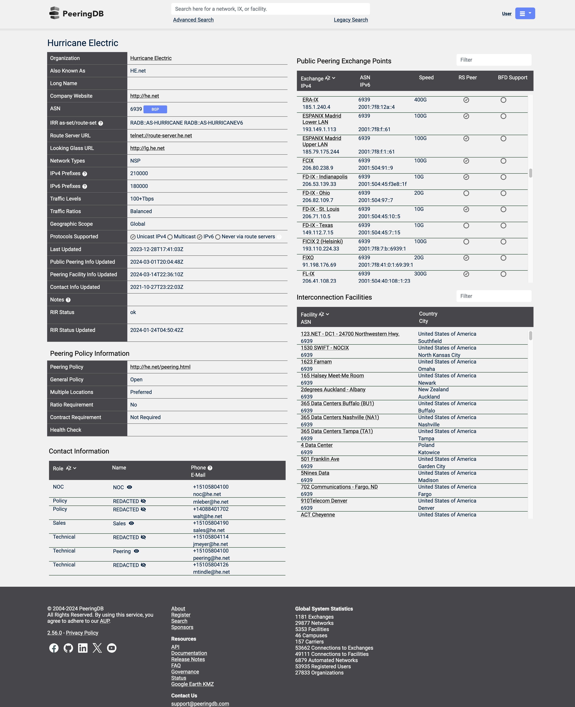

# PeeringDB Modern
A userscript to modernize and improve PeeringDB UI.



### Introduction
This userscript has been made outside business hours, just for fun. PeeringDB is the de facto network peering platform currently available. However, it does have some major drawbacks as it seems to be quite outdated in terms of looks, it's quite slow and many more issues.
The good thing is that we can tweak the UI to our likings using userscripts! This script initially started by adding a BGP button that redirects to bgp.tools.

### Features
- Automatically injects button with a link to BGP.Tools for the ASN.
- Improve UI, easier on the eye.
- Sticky navbar.
- New Roboto font.

### Usage
The script has been tested with Greasemonkey, Tampermonkey and Violentmonkey, should work on both Firefox and Chrome. In case you are using Chrome, consider switching to Firefox!

### Disclaimer
Use this at your own risk.

### License
```
MIT License
```